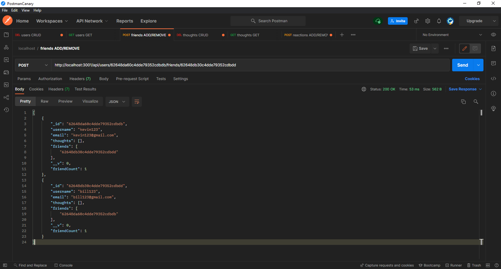

# Social🧑‍🤝‍🧑Network🤖API

## Table of Contents
* [Description](#Description)
* [Installation](#Installation)
* [Usage](#Usage)
* [Questions](#Questions)
* [Credits](#Credits)

## Description
Social🧑‍🤝‍🧑Network🤖API is a simple API built to be used as the backend for a social network website. The languages and technologies used to build this application are: JavaScript, ES6, MongoDB, & Mongoose.

## Usage
Create a user, add a user as a friend, share your thoughts, & react to the thoughts of other users! See this video tutorial for an in-depth look into what you can do with the API:

## Installation
In order to use this API you must clone this repository to your machine. 

## Questions
If you have any questions about this project, please contact me via GitHub [here](https://github.com/garretthilberling)

## Credits
This project was created by:
* Garrett Hilberling: [LinkedIn](https://www.linkedin.com/in/garretthilberling/)

    
